# LLM_EcoCircuit (In Development)

EcoCircuit is an LLM-based web application for generative flow diagrams. As an educative tool for environmental engineering, it generates flow / circular economy diagram and allows freedom for users to doodle and modify.

This realease realizes all below function of Sherbot. The interactivity of the web will be improved in the next release
### Init
1. Activate virtual environment and python dependencies
2. cd "static", install node modules in package-lock, this project uses leader-line and plain-draggable package by anseki
3. The webapp is powered by gpt-4 and dalle2, you can adapt the code to the model you selected accordingly
4. Run python app.py, the webpage will open

### GENERATE FLOW
1. "GENERATE FLOW" is the button to send new TEXT-TO-FLOW DIAGRAM request.
2. First, Input your environmental description here, click "GENERATE FLOW"

3. The web will generate a compacted view of input-to-output flow. 

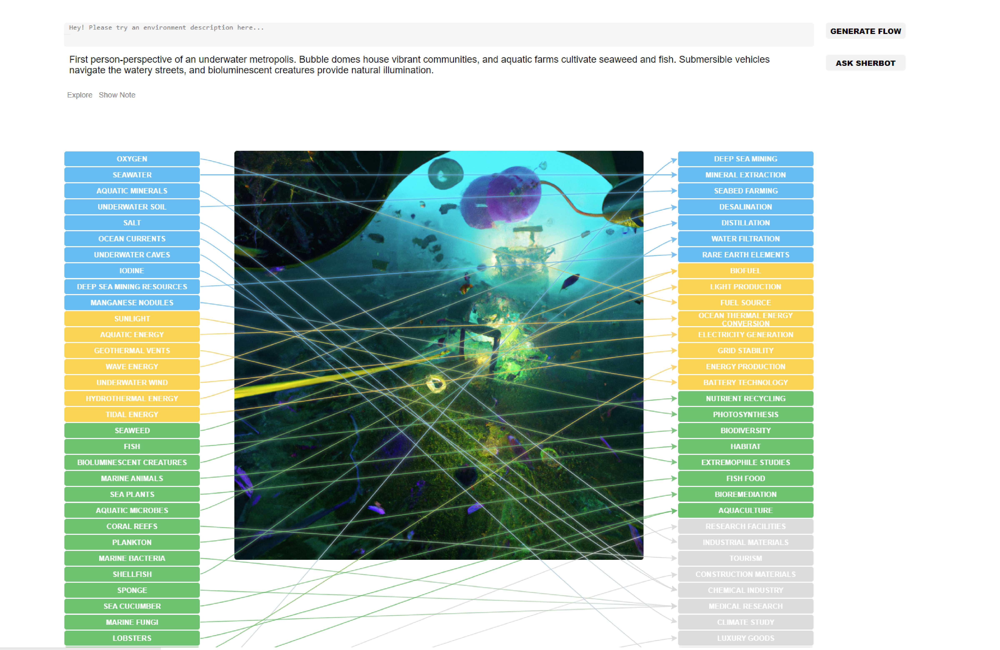

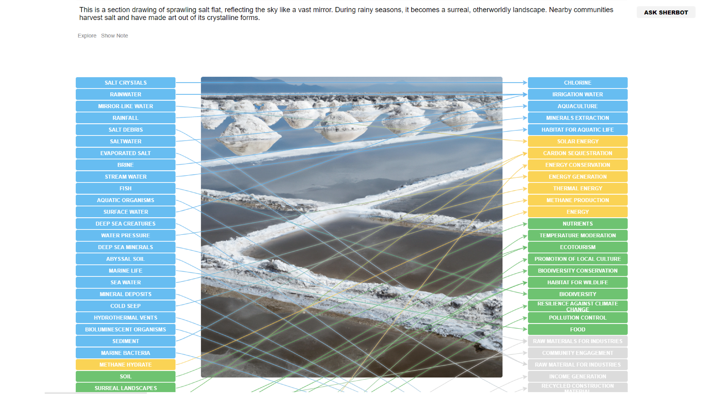

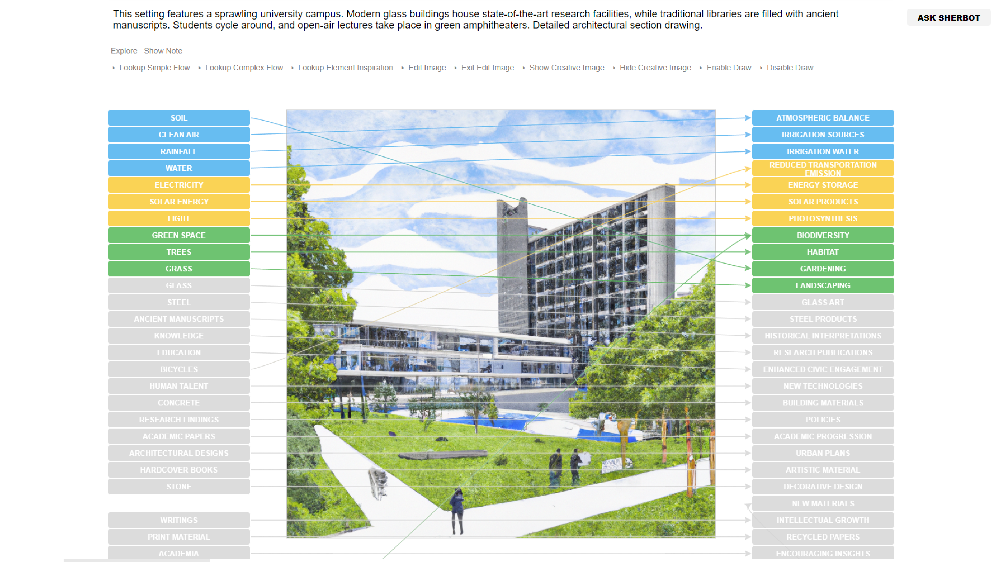

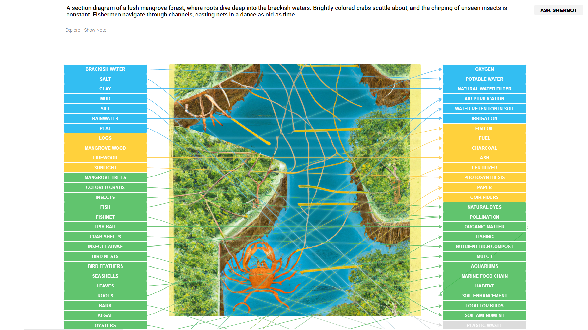

4. You can toggle image on and off by "Explore > Show Creative Image" and "Explore > Hide Creative Image" 

### ASK SHERBOT
1. "ASK SHERBOT" is the button to send new request based on the element selections.

##### Trial 1
1. Try, right-click to select one element, such as "OXYGEN"

2. Then, click "ASK SHERBOT" 

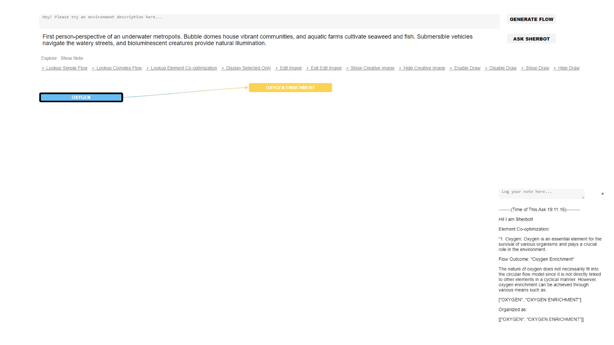

3. Now, go back to by clicking "Explore > Lookup Simple Flow"

##### Trial 2
1. Try, right-click to select one flow, such as  right-click "OXYGEN" --> select "Select Output Flow"--> "FUEL SOURCE"

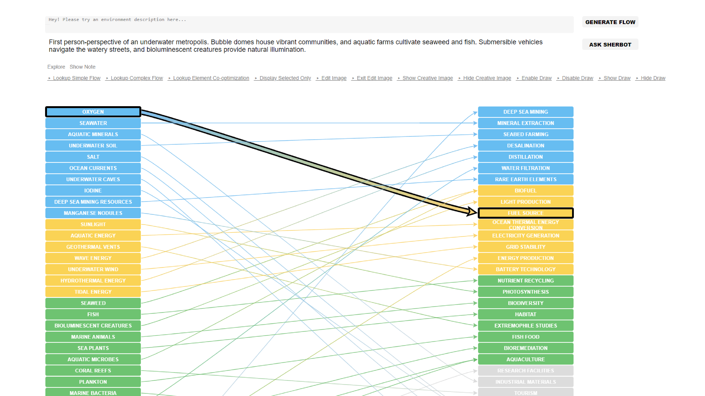

2. Then, click "ASK SHERBOT"
3. The tool will expand on the internal process for generating flow
   This process can be revisited by click "Explore > Lookup Complex Flow"

4. Now, go back to by clicking "Explore > Lookup Simple Flow"

##### Trial 3
1. Try, right-click on multiple element and multiple flow, like below

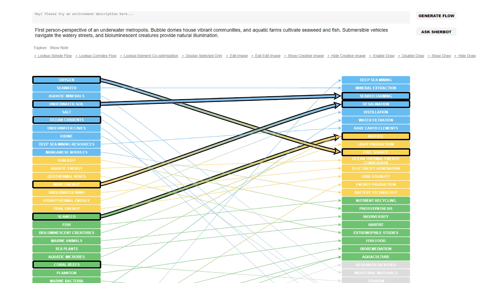

2. Then, click "ASK SHERBOT"
3. It will generate a complex flow view, delinating multiple processes for going from input to output

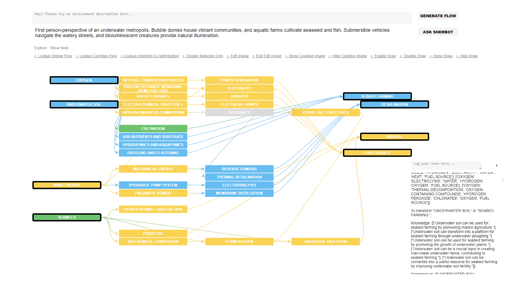

4. Navigate to "Explore > Lookup Element Co-optimization" It will generate a networked flow view, delinating how all the elements can be connected

5. Now, go back to by clicking "Explore > Lookup Simple Flow"

##### Trial 4
1. Select all element and flow

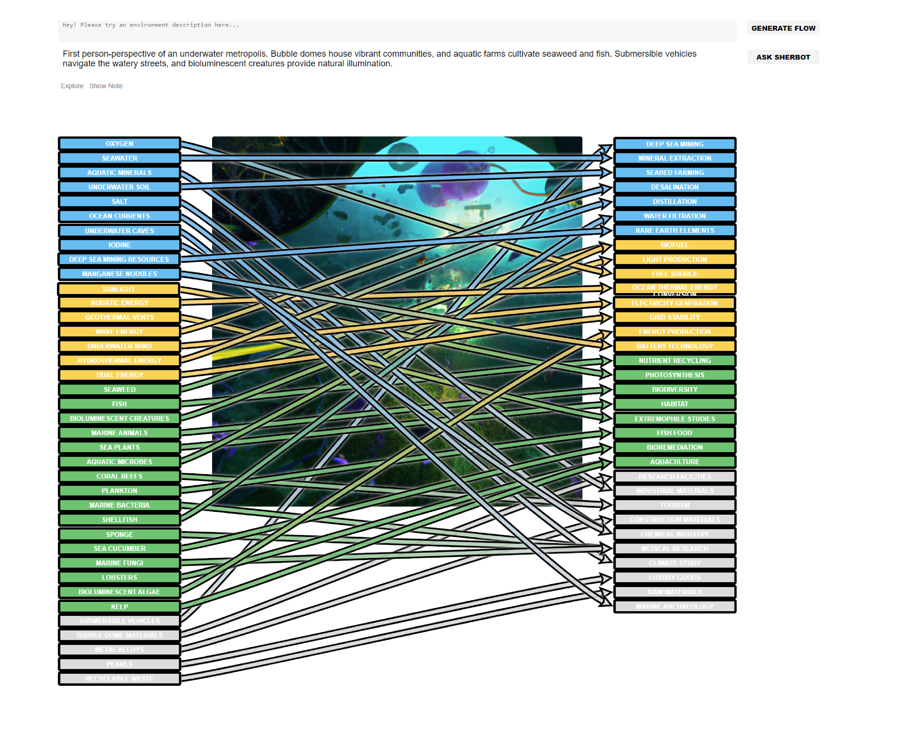

2. Then, click "ASK SHERBOT"
3. Then, click "Explore > Lookup Complex Flow"

4. Then, click "Explore > Element Co-optimization"

   As ChatGPT will never generate the same result, this is another result generated with this prompt and process

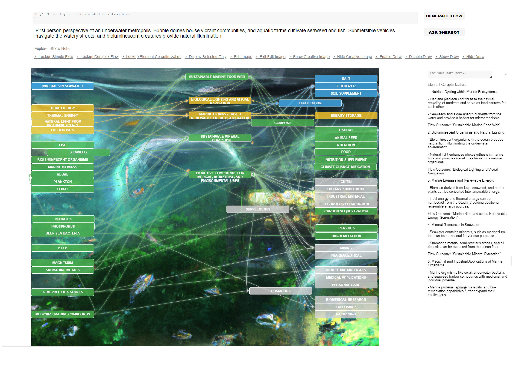

### This tool contains many features for human customization
1. Including Regenerate Image / Drag Image / Draw / Edit Image Size / Show Notes / Modify input and output / Add New Tag

Below are some examples.

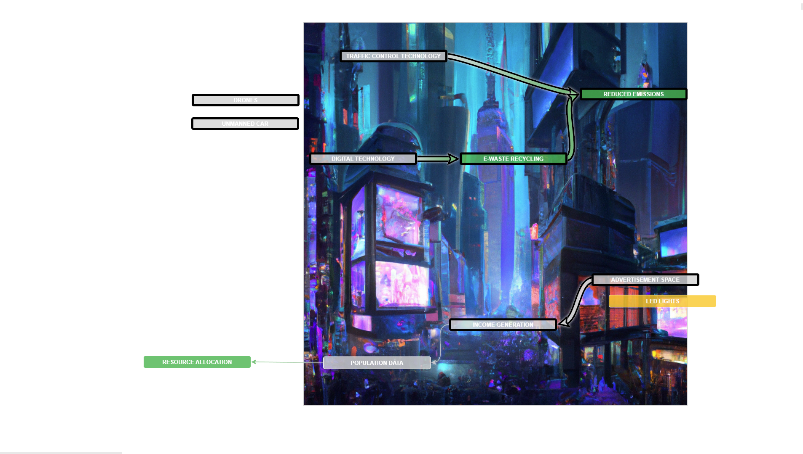

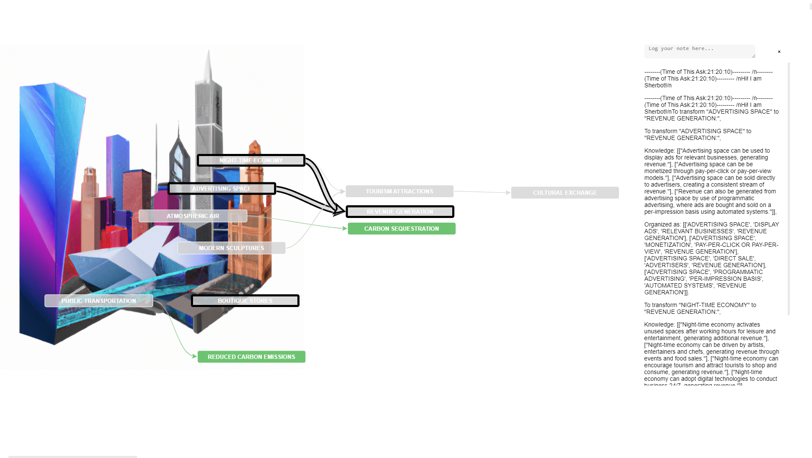

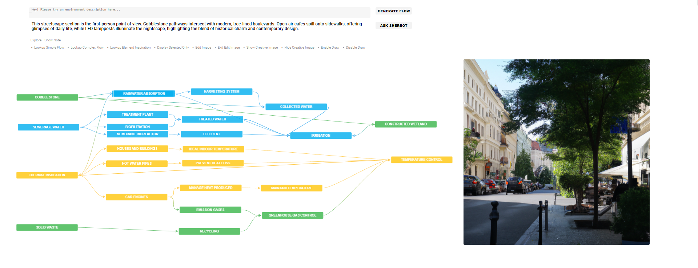

